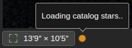

# Aladdin 

Controls UI (upper left)
- Show Catalog
- AGS
- Sci. Offsets
- Acq. Offsets
- Scroll to zoom

Field of View (lower left) 

Cursor Coordinates (lower right)

Center Target button (lower right)

Zoom buttons (middle right)

Full-Panel button (upper right)

AGS Info (lower left)
- Displays the guide star ID, brightness, and coordinates with the expected guide speed (Fast, Medium, or Slow).
- "Mode or ITC not available" indicates that the instrument field of view and guide star cannot be displayed because a configuration has not been selected.
- "No guide star available" indicates that there is no guide star bright enough for the selected conditions.
- "No catalog stars available" indicates that there were no stars found in the guider patrol field.
- Blinking orange indicator with the tooltip "Loading catalog stars"  means that Explore is attempting to download guide star data from the [Gaia database](https://gea.esac.esa.int/archive).  This is typically accompanied by the previous warning.

AGS Rules:
1. Select all the stars that allow "Fast" guiding.  If there are none then select all the stars that support "Medium" guiding.  If there are none then select all the stars that can be used with the "Slow" guide speed.
2. If there is more than one star then find the maximum vignetting for each star over all offset positions and choose the stars with the least vignetting.
3. If more than one star remains then select the one that is that is the brightest, up to the limit of the guider.
