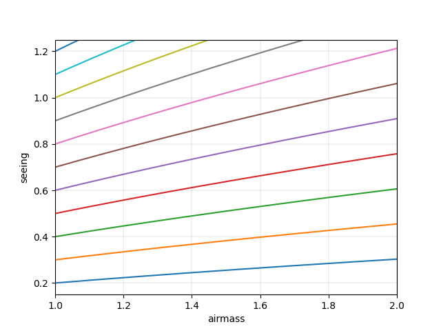

# Image Quality

The image quality constraint is the **on-source** image quality in arcseconds **as measured at the science wavelength**.
The seeing is a function of airmass and wavelength, and requesting very good seeing conditions may limit an observation's schedulability.
This is quantified by the likelihood given to the right of the selected image quality.
The likelihood is estimated from archival data and requires knowing the target declination, the observation site, and the observation wavelength
(**the likelihood will be blank until all of these parameters are defined**).

