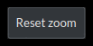
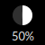
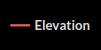
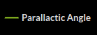
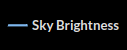
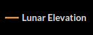
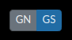
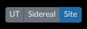

# Elevation Plot

### Title

The plot title shows the _local_ dates at sunset and sunrise.

### Almanac

The evening and morning 12° twilights are indicated on the sides of the plot for the selected site and in the selected time zone.

### Zoom  <!--  -->

To zoom in on a region of the plot, use the mouse to select and hold one corner of the zoom area, drag to the opposite corner, and release.  A "Reset zoom" button will appear in the upper right of the plot area and clicking it will return to the default zoom level.

### Moon Phase 

The upper right corner of the elevation plot panel shows the lunar illumination at the _middle_ of the the selected night.

### Elevation 

Selecting the Elevation in the plot legend will toggle the plot of the target elevation.
Hovering the mouse cursor over the curve will display a tool-tip with the time, elevation, and airmass.

### Parallactic Angle 

Selecting the Parallactic Angle in the plot legend will toggle the plot of the target elevation and the Parallactic angle axis will appear on the right of the plot.  Hovering the the mouse cursor over the curve will display a tool-tip with the time and parallactic angle value.

### Sky Brightness 

Selecting Sky Brightness in the plot legend will toggle the plot of the sky brightness at the position of the target from the selected site, and the sky brightness axis will appear on the right of the plot (V-band magnitudes/arcsec²).  Three horizonal dashed lines show the boundaries between "Bright", "Gray", "Dark", and "Darkest" sky.

### Lunar Elevation 

Selecting "Lunar Elevation" in the legend will toggle the plot of the elevation of the moon and hovering the mouse cursor over the curve will display a tool-tip with exact values.

### Site Selector 

The site selector buttons allow manually selecting whether to plot data for Gemini North (GN) or Gemini South (GS).
When an observation has an instrument defined the plot will default to the site of the instrument.
In this case the site selector buttons may be used to _temporarily_ select the other site if desired.

### Date Selector

The date of the plot may be incremnted one night at a time using the `<` and `>` buttons, by typing into the date box, or using the calendar widget that appears when the date box is selected.

Note that changing the `Observation Time` in the Targets panel will update the date in the elevation plot.

### Night / Semester Selector 

The Night plot shows the target elevation, parallactic angle, sky brightness, and lunar elevation throughout the selected night.

The Semester plot shows the target visibility from the selected site for the semester that includes the selected date.

### Time Zone Selector 

The time zone selector may be used to toggle the Night plot time axis between Universal Time (UT), Sidereal time, and local time at the selected site.
